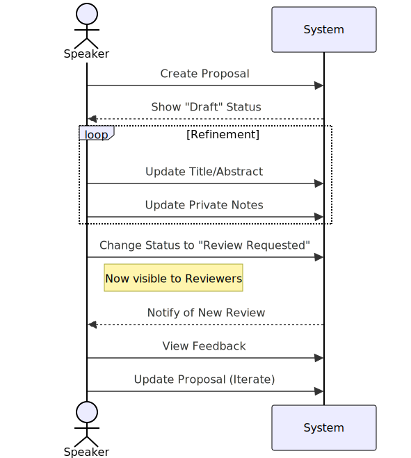
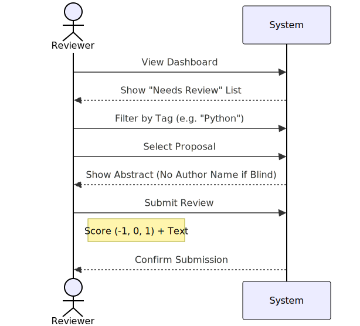
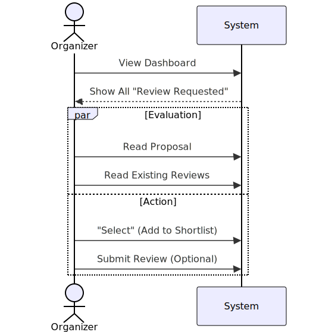

# CFP-Review System Design Guide

## 1. System Overview
The **CFP-Review** system is a centralized portfolio for speakers to manage their talk proposals and receive feedback from a community of peers and mentors. Unlike standard conference tools, it focuses on the speaker's development and discovery.

Additionally, it serves as a talent pool for **Organizers** to scout for speakers.

## 2. User Flows

### Speaker Flow

### Reviewer Flow

### Organizer Flow

### Key Workflows
*   **Speaker (Author)**:
    *   Creates proposals (Draft -> Review Requested).
    *   Iterates based on feedback.
*   **Reviewer (Mentor)**:
    *   Browses "Needs Review".
    *   Provides feedback and scores.
*   **Organizer (Scout)**:
    *   Browses "Review Requested" proposals.
    *   Can view reviews/scores left by mentors (to gauge quality).
    *   **Selects/Recommends** talks (adds to personal shortlist).

## 3. Database Schema (Normalized)

### Core Entities
*   **User**: Standard Django user.
*   **Proposal**: Owned by Author.
*   **Review**: Feedback by Reviewer.
*   **Selection**: Shortlist entry by Organizer.
*   **Tag**: Categories.

### Access Control Logic
*   **Reviewers Group**: `can_review`.
*   **Organizers Group**: `can_select`.
*   **Authors**: Implicit ownership.

## 4. Visual & Interface Guidelines
*   **Speaker Dashboard**: "My Proposals".
*   **Reviewer Dashboard**: "Needs Review" (Feed).
*   **Organizer Dashboard**: "Scouted Talks" (Shortlist) & "Discover" (Feed).
