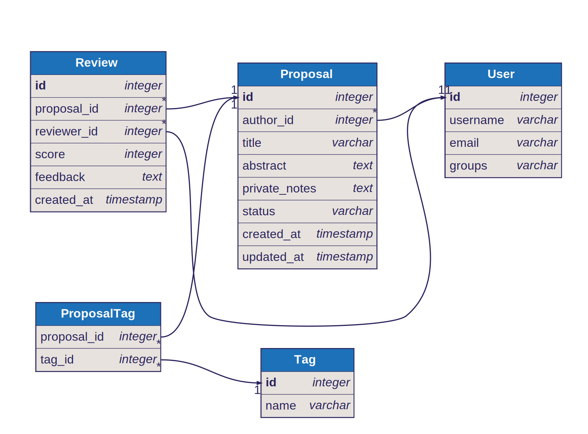

# CFP-Review

A Django-based application serving as a **Speaker Portfolio and Mentorship Platform**. This system allows speakers to maintain a library of their talk proposals, refine them with private notes, and request feedback from a community of reviewers/mentors before submitting to real conferences.

## Features

Based on the project's [MERISE Analysis](MERISE_PLAN.md), the system includes:

*   **Proposal Management**: Speakers can create, edit, and organize their talk ideas.
*   **Privacy Controls**: Proposals start as **Drafts** (private) and can be toggled to **Review Requested** (visible to mentors).
*   **Mentorship System**: Users with the `Reviewer` role can browse requested proposals and provide structured feedback.
*   **Categorization**: A tagging system (e.g., "Python", "Cloud", "Career") helps reviewers find relevant content.
*   **Private Notes**: Speakers can keep "notes to self" attached to proposals that reviewers do not see (or do see, depending on final implementation choice - currently defined as private).

## Data Model

The core entities defined in the system are:

*   **User**: Standard Django user with `Reviewer` group designation.
*   **Proposal**: The central content object.
*   **Review**: Feedback linked to a Proposal.
*   **Tag**: Categories for filtering.



## Tech Stack

*   **Language**: Python
*   **Framework**: Django
*   **Database**: PostgreSQL
*   **Package Manager**: `uv`

## Getting Started

### Prerequisites

*   Python 3.12+
*   [uv](https://github.com/astral-sh/uv)
*   PostgreSQL

### Installation

1.  **Install dependencies:**
    ```bash
    uv sync
    ```

2.  **Database Setup:**
    Ensure your PostgreSQL database is running.
    ```sql
    CREATE DATABASE cfp_db;
    ```
    *(Note: Adjust your `settings.py` or `.env` to point to this database)*

3.  **Apply Migrations:**
    ```bash
    uv run python manage.py migrate
    ```

4.  **Create a Superuser:**
    ```bash
    uv run python manage.py createsuperuser
    ```

5.  **Run the Development Server:**
    ```bash
    uv run python manage.py runserver
    ```

## Development

See [MERISE_PLAN.md](MERISE_PLAN.md) for detailed documentation on the data dictionary, conceptual model (MCD), and logical model (MLD).
